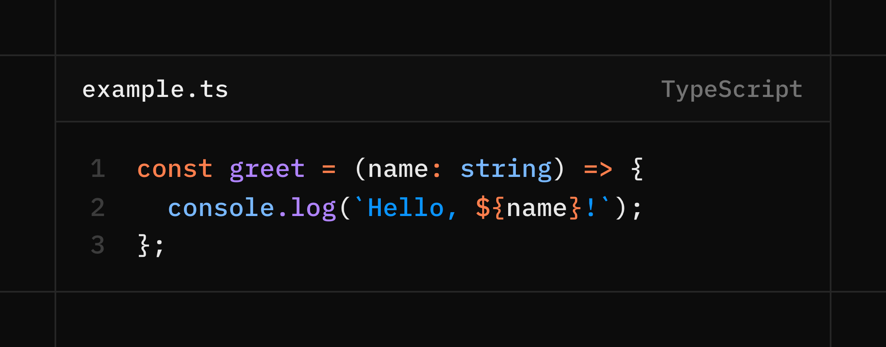

# rayshot

Generate beautiful code screenshots from [ray.so](https://ray.so) via the command line.



## Installation

```bash
# Clone and install
git clone https://github.com/kristianfreeman/rayshot.git
cd rayshot
npm install

# Link globally (optional)
npm link
```

## Usage

```bash
# Basic usage - pass code directly
rayshot "const x = 1;" -o screenshot.png

# From a file
rayshot ./snippet.ts --output screenshot.png

# With options
rayshot "console.log('hello')" --theme vercel --language javascript --name app.js

# Pipe from stdin
cat myfile.py | rayshot - --language python -o output.png

# Light mode
rayshot "const x = 1;" --light --theme candy
```

## Options

| Option | Alias | Description | Default |
|--------|-------|-------------|---------|
| `--theme` | `-t` | Theme name | `cloudflare` |
| `--language` | `-l` | Syntax highlighting language | `typescript` |
| `--output` | `-o` | Output file path | `./rayshot.png` |
| `--name` | `-n` | Filename shown in header | none |
| `--padding` | `-p` | Padding in pixels | `32` |
| `--dark` | `-d` | Dark mode | `true` |
| `--light` | | Light mode | |
| `--list-themes` | | List all available themes | |
| `--list-languages` | | List all available languages | |
| `--help` | `-h` | Show help | |

## Themes

### Partner Themes
- `cloudflare` - Cloudflare (orange/dark)
- `vercel` - Vercel (black/white)
- `supabase` - Supabase (green/dark)
- `tailwind` - Tailwind CSS (blue)
- `openai` - OpenAI (black/green)
- `stripe` - Stripe (blue/purple)
- `prisma` - Prisma (teal)
- `clerk` - Clerk (purple)
- `mintlify` - Mintlify (green)
- `elevenlabs` - ElevenLabs (purple)
- `resend` - Resend (black/white gradient)
- `triggerdev` - Trigger.dev (purple)
- `nuxt` - Nuxt (green)
- `browserbase` - Browserbase (orange)
- `gemini` - Google Gemini (blue)

### Community Themes
- `noir`, `mono`, `breeze`, `candy`, `crimson`, `falcon`, `meadow`, `midnight`, `raindrop`, `sunset`, `bitmap`, `ice`, `sand`, `forest`

Run `rayshot --list-themes` for the full list.

## Languages

Supports all major languages including:

`typescript`, `javascript`, `python`, `swift`, `go`, `rust`, `java`, `kotlin`, `cpp`, `c`, `csharp`, `ruby`, `php`, `shell`, `sql`, `json`, `yaml`, `html`, `css`, `markdown`, and more.

Run `rayshot --list-languages` for the full list.

## Examples

### Tweet-ready Cloudflare code snippet
```bash
rayshot 'const handler = async (req: Request) => {
  return new Response("Hello from Workers!");
};' --theme cloudflare --name worker.ts -o tweet.png
```

### Dark Vercel-themed React component
```bash
rayshot ./Component.tsx --theme vercel --dark -o component.png
```

### Python with Supabase theme
```bash
rayshot "def hello():
    print('Hello, World!')" --theme supabase --language python -o hello.png
```

## How it works

rayshot uses [Playwright](https://playwright.dev) to:
1. Open ray.so with your code and settings encoded in the URL
2. Wait for the code frame to render
3. Click the "Export" button
4. Save the downloaded PNG

## Requirements

- Node.js 18+
- Chromium (automatically installed by Playwright)

## License

MIT

## Credits

- [ray.so](https://ray.so) by [Raycast](https://raycast.com) - The beautiful code screenshot tool
- Built for making tweet-worthy code snippets
